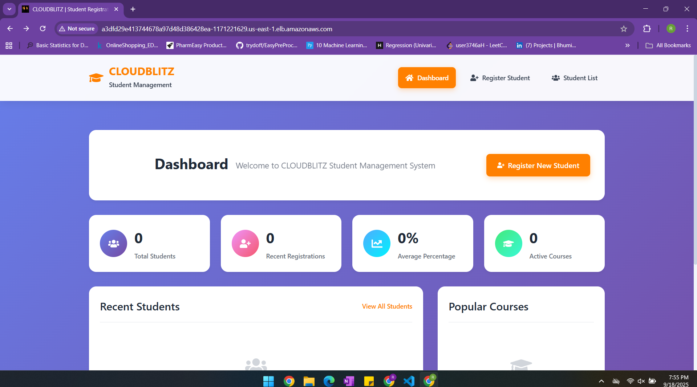
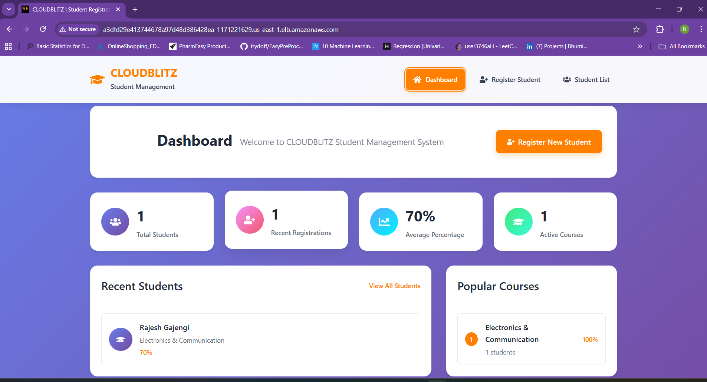
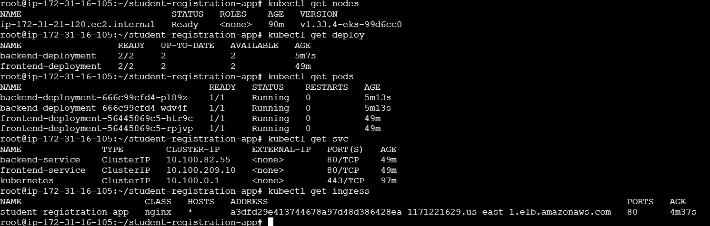

# EasyCRUD - Student Registration System (DevOps Project)

## 📖 About the Project

This project demonstrates how to take a full-stack application (React frontend + Spring Boot backend) and productionize it using DevOps practices.

The application allows students to register with basic details. For simplicity, the backend uses in-memory storage (no external DB), making it lightweight for DevOps demonstrations.

The goal of this project is to showcase end-to-end DevOps workflows:

- Cloning and preparing application code
- Writing Dockerfiles for frontend and backend
- Building and pushing Docker images to Docker Hub
- Writing Kubernetes manifests (deployments, services, ingress)
- Deploying to a Kubernetes cluster with ingress routing
- Preparing the foundation for CI/CD (Jenkins/GitHub Actions)

## ✨ Features

- Full-stack app (React + Spring Boot)
- Containerized using Docker
- Images pushed to Docker Hub
- Multi-service orchestration with Kubernetes
- Ingress routing (/ → frontend, /api → backend)
- Easily extendable for CI/CD pipelines

## 🛠️ Tech Stack

- Frontend: React
- Backend: Spring Boot (Java)
- Containerization: Docker, Docker Hub
- Orchestration: Kubernetes (Minikube/Kind/EKS)
- Networking: Ingress Controller (NGINX)
- CI/CD (future): Jenkins / GitHub Actions

## 📂 Project Structure
```
student-registration-app/
│── app/
│   ├── frontend/                 # React frontend code
│   ├── backend/                  # Spring Boot backend code
│
│── docker/                       # Dockerfiles and Compose
│   ├── frontend.dockerfile
│   ├── backend.dockerfile
│   ├── docker-compose.yml
│
│── k8s/                          # Kubernetes manifests
│   ├── frontend-deployment.yml
│   ├── backend-deployment.yml
│   ├── frontend-service.yml
│   ├── backend-service.yml
│   ├── ingress.yml
│
│── ci-cd/                        # (future) Jenkins / GitHub Actions pipeline
│── docs/                         # Screenshots & diagrams
│── README.md                     # Documentation

```
<!-- │── .env.example                  # Example environment variables -->

## Architecture

## ⚙️ Prerequisites

- Git – to clone repository
- Docker – for building & running containers
- Docker Hub account – for pushing images
- Kubernetes cluster – Minikube, Kind, or AWS EKS
- Kubectl – CLI to interact with K8s
- Ingress Controller – NGINX ingress controller installed in cluster

## 🔄 Flow of the Project
#### 1. Clone Application Repository

```bash
git clone https://github.com/RajeshGajengi/student-registration-app
cd student-registration-app
```

#### 2. Dockerize Application

- Created separate Dockerfiles for frontend & backend
- Image build commands:
```bash
docker build -t <dockerhub-username>/easycrud-backend:latest -f docker/backend.dockerfile ./app/backend
docker build -t <dockerhub-username>/easycrud-frontend:latest -f docker/frontend.dockerfile ./app/frontend
```

#### 3. Push to Docker Hub
```bash
docker push <dockerhub-username>/easycrud-frontend:latest
docker push <dockerhub-username>/easycrud-backend:latest
```

#### 4. Containerize with Kubernetes

Created deployments, services, and ingress
```bash
kubectl apply -f k8s/backend-deployment.yaml
kubectl apply -f k8s/backend-service.yaml
kubectl apply -f k8s/frontend-deployment.yaml
kubectl apply -f k8s/frontend-service.yaml
kubectl apply -f k8s/ingress.yaml
```
Before applying ingress, install the NGINX Ingress Controller:
```bash
kubectl apply -f https://raw.githubusercontent.com/kubernetes/ingress-nginx/main/deploy/static/provider/cloud/deploy.yaml
```
#### 5. Verify Deployment
```bash
kubectl get pods
kubectl get svc
kubectl get ingress

```

#### 6. Ingress Routing

- `/` → Frontend (React)

- `/api` → Backend (Spring Boot)

#### 7. Access Application

- Frontend: `http://<Ingress-dns>/`

- Backend API: `http://<ingress-dns>/api`


## Results:
**Frontend Result**


**Kubernetes Results: Pods, Services, Ingress**



## 🚀 Future Enhancements

- Add persistent DB (MySQL/Postgres) with K8s StatefulSet
- Implement CI/CD pipeline (Jenkins/GitHub Actions)
- Setup Monitoring & Logging (Prometheus + Grafana, EFK Stack)
- Deploy on AWS EKS with RDS backend
- Use Kubernetes Secrets for sensitive configs