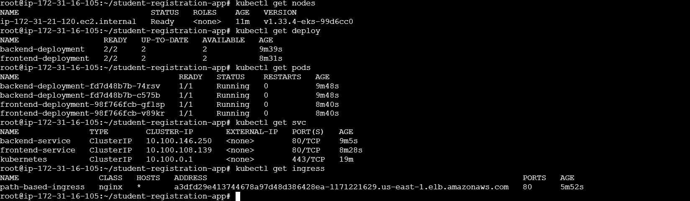

# EasyCRUD - Student Registration System (DevOps Project)

## 📖 About the Project

This project demonstrates how to take a full-stack application (React frontend + Spring Boot backend) and productionize it using DevOps practices.

The application allows students to register with basic details. The backend now connects to an Amazon RDS database (instead of in-memory storage), making the system closer to a real-world production setup.

The main goal of this project is to showcase an end-to-end DevOps workflow, covering:

- Cloning and preparing application code
- Writing Dockerfiles for frontend & backend
- Building and pushing Docker images to Docker Hub
- Writing Kubernetes manifests (Deployments, Services, Ingress)
- Managing Secrets for database credentials
- Deploying to a Kubernetes cluster on AWS EKS with Ingress routing
- Setting up a foundation for CI/CD pipelines (Jenkins / GitHub Actions)

## ✨ Features

- Full-stack app (React + Spring Boot)
- Backend connected to Amazon RDS (MySQL/Postgres)
- Kubernetes Secrets for managing DB credentials
- Containerized using Docker
- Images stored in Docker Hub
- Orchestrated with Kubernetes on AWS EKS
- Ingress routing: `/` → frontend, `/api` → backend
- Extensible for CI/CD and monitoring integrations

## 🛠️ Tech Stack

- Frontend: React
- Backend: Spring Boot (Java)
- Database: Amazon RDS (MySQL/Postgres)
- Secrets Management: Kubernetes Secrets
- Containerization: Docker, Docker Hub
- Orchestration: Kubernetes (EKS)
- Networking: Ingress Controller (NGINX)
- CI/CD (future): Jenkins / GitHub Actions

## 📂 Project Structure
```
student-registration-app/
│── app/
│   ├── frontend/                 # React frontend code
│   ├── backend/                  # Spring Boot backend code
│
│── docker/                       # Dockerfiles and Compose
│   ├── frontend.dockerfile
│   ├── backend.dockerfile
│   ├── docker-compose.yml
│
│── k8s/                          # Kubernetes manifests
│   ├── frontend-deployment.yml
│   ├── backend-deployment.yml
│   ├── frontend-service.yml
│   ├── backend-service.yml
│   ├── ingress.yml
│   ├── secrets.yml               # DB credentials
│
│── ci-cd/                        # (future) Jenkins / GitHub Actions pipeline
│── docs/                         # Screenshots & diagrams
│── README.md                     # Documentation


```
<!-- │── .env.example                  # Example environment variables -->

## 🏗️ Architecture


## ⚙️ Prerequisites

- Git – to clone repository
- Docker – for building & running containers
- Docker Hub account – for pushing images
- AWS EKS Cluster with worker nodes
- Kubectl – CLI to interact with EKS
- AWS CLI configured with IAM user/role
- NGINX Ingress Controller installed in cluster

## 🔑 Environment Variables
#### Kubernetes Secret (secrets.yml)
```yml
apiVersion: v1
kind: Secret
metadata:
  name: db-credentials
type: Opaque
data:
  username: YWRtaW4=        # base64 for "admin"
  password: UmFqZXNoMTIzNA== # base64 for "Rajesh1234"
```
In `backend-deployment.yml`, mount secrets as env vars:

```yaml
env:
    - name: SPRING_DATASOURCE_URL
      value: "jdbc:mysql://mydb-instance.cujwsmiewj2i.us-east-1.rds.amazonaws.com:3306/student_db"
    - name: SPRING_DATASOURCE_USERNAME
      valueFrom:
        secretKeyRef:
          name: db-credentials
          key: username
    - name: SPRING_DATASOURCE_PASSWORD
      valueFrom:
        secretKeyRef:
          name: db-credentials
          key: password
```


## 🔄 Flow of the Project
#### 1. Clone Application Repository

```bash
git clone https://github.com/RajeshGajengi/student-registration-app
cd student-registration-app
```
#### 2. Setup Database on Amazon RDS
1. Create an RDS instance (MySQL).
2. Install MySQL client:
```bash
apt install mysql-client -y  
```
3. Connect to RDS:
```sql
mysql -h <RDS-endpoint> -u <db-username> -p
```
4. Create a new database:
```sql
CREATE DATABASE student_db;
EXIT;
```
5. Load schema file:
```bash
# MySQL
mysql -h <RDS-endpoint> -u <db-username> -p student_db < app/database/database_schema.sql
```
📌 More details: 


#### 3. Dockerize Application

- Separate Dockerfiles are provided for frontend and backend inside `docker/`
- Image build commands:
```bash
docker build -t <dockerhub-username>/easycrud-backend:latest -f docker/backend.dockerfile ./app/backend
docker build -t <dockerhub-username>/easycrud-frontend:latest -f docker/frontend.dockerfile ./app/frontend
```

#### 4. Push to Docker Hub
```bash
docker push <dockerhub-username>/easycrud-frontend:latest
docker push <dockerhub-username>/easycrud-backend:latest
```

#### 5. Containerize with Kubernetes (AWS EKS)

Created deployments, services, and ingress
```bash
kubectl apply -f k8s/secrets.yml
kubectl apply -f k8s/backend-deployment.yml
kubectl apply -f k8s/backend-service.yml
kubectl apply -f k8s/frontend-deployment.yml
kubectl apply -f k8s/frontend-service.yml
kubectl apply -f k8s/ingress.yml

```
Before applying ingress, install the NGINX Ingress Controller:
```bash
kubectl apply -f https://raw.githubusercontent.com/kubernetes/ingress-nginx/main/deploy/static/provider/cloud/deploy.yaml
```
#### 6. Verify Deployment
```bash
kubectl get pods
kubectl get svc
kubectl get ingress
kubectl get secrets
```

#### 7. Ingress Routing

- `/` → Frontend (React)

- `/api` → Backend (Spring Boot connected to RDS)

#### 8. Access Application

- Frontend: `http://<Ingress-dns>/`
- Backend API: `http://<ingress-dns>/api`
- Database: Hosted on Amazon RDS

## Results:
**Frontend Result**


**Database Result**

**Kubernetes Results: Pods, Services, Ingress**



## 🚀 Future Enhancements

- Implement CI/CD pipeline (Jenkins/GitHub Actions) for auto build & deploy
- Setup Monitoring & Logging (Prometheus + Grafana, EFK Stack)
- Add Auto-scaling with HPA (Horizontal Pod Autoscaler)
- Use AWS Secrets Manager / SSM Parameter Store for DB credentials
- Enable HTTPS with Cert-Manager + Let’s Encrypt
